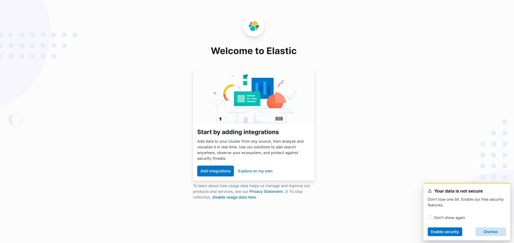
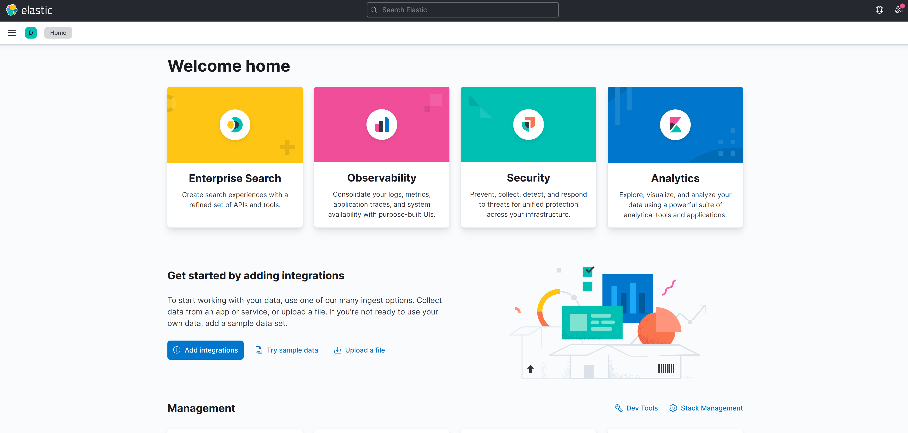
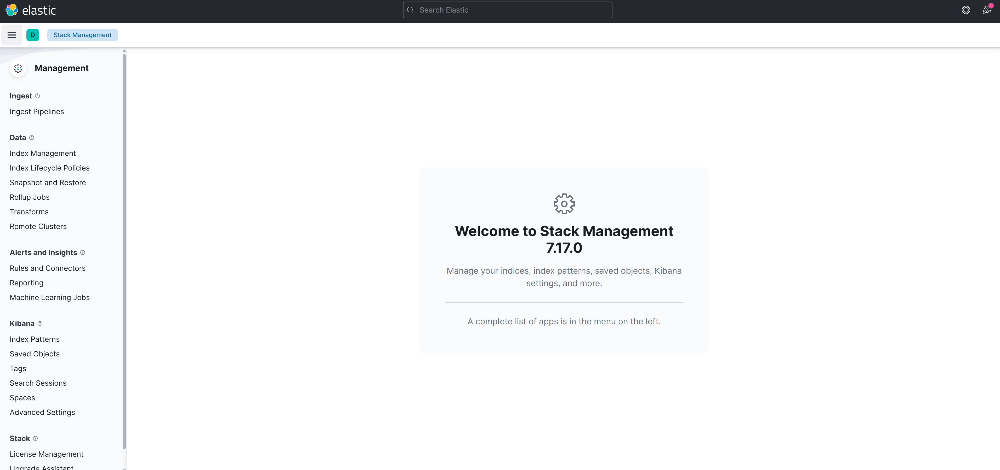
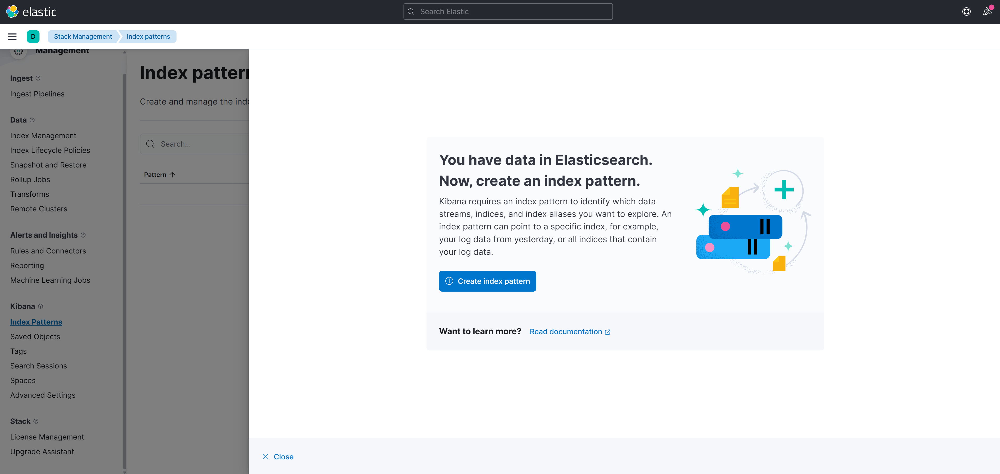
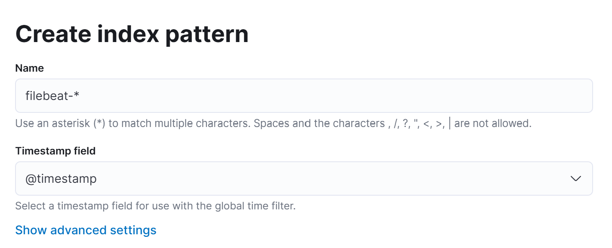
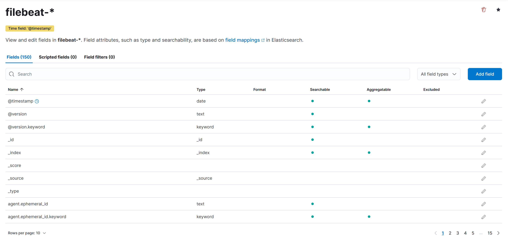
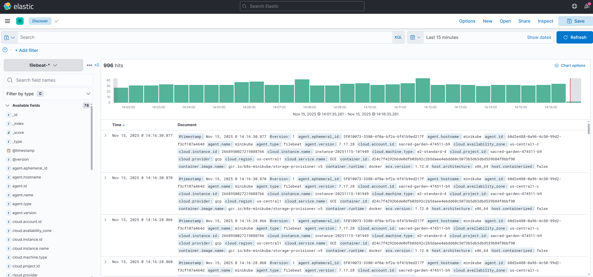
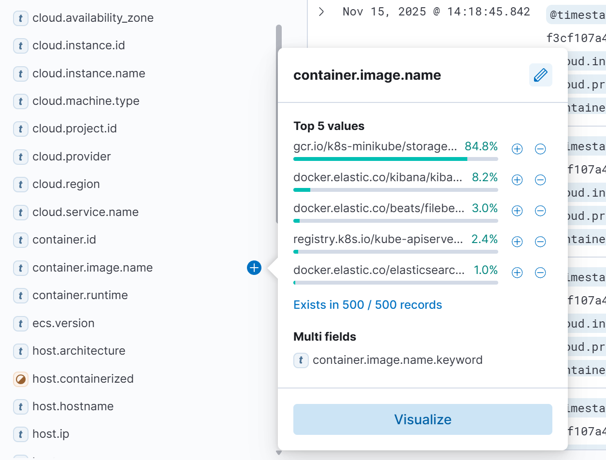

# 🟣 **ELK Stack Logging Setup — LLMOps Travel Itinerary Planner**

This stage sets up a complete **ELK (Elasticsearch, Logstash, Kibana) logging pipeline** inside your **Minikube Kubernetes cluster** running on your **GCP VM**.

You will:

* Create a dedicated `logging` namespace
* Deploy **Elasticsearch** (persistent storage, single node)
* Deploy **Kibana** (web UI for visualising logs)
* Deploy **Logstash** (receives logs from Filebeat and pushes to Elasticsearch)
* Deploy **Filebeat** (collects logs from all pods in the cluster)
* Expose Kibana externally via port-forwarding
* Configure Kibana with index patterns
* Explore your live logs using the Discover dashboard

This README captures the entire workflow, including the **exact commands** and **exact outputs** you obtained, along with a full Kibana setup walkthrough using your screenshots.


## ▶️ **Step 1 — Open a New VM Terminal**

All steps below take place in a **fresh terminal session** inside your GCP VM.


## ▶️ **Step 2 — Create the Logging Namespace**

```bash
kubectl create namespace logging
```

Output:

```
namespace/logging created
```

Check that the namespace exists:

```bash
kubectl get ns
```

Output:

```
NAME              STATUS   AGE
default           Active   111m
kube-node-lease   Active   111m
kube-public       Active   111m
kube-system       Active   111m
logging           Active   83s
```


## ▶️ **Step 3 — Deploy Elasticsearch**

```bash
kubectl apply -f elasticsearch.yaml
```

Output:

```
persistentvolumeclaim/elasticsearch-pvc created
deployment.apps/elasticsearch created
service/elasticsearch created
```

Check the pod:

```bash
kubectl get pods -n logging
```

Output:

```
NAME                             READY   STATUS    RESTARTS      AGE
elasticsearch-576cd6f7cc-zwb2f   1/1     Running   5 (91s ago)   3m31s
```

Check the PVC:

```bash
kubectl get pvc -n logging
```

Output:

```
NAME                STATUS   VOLUME                                     CAPACITY   ACCESS MODES   STORAGECLASS   VOLUMEATTRIBUTESCLASS   AGE
elasticsearch-pvc   Bound    pvc-f80df407-3f57-4028-9c27-eb6e11e6ea2a   2Gi        RWO            standard       <unset>                 4m30s
```

Check the Persistent Volume:

```bash
kubectl get pv -n logging
```

Output:

```
NAME                                       CAPACITY   ACCESS MODES   RECLAIM POLICY   STATUS   CLAIM                       STORAGECLASS   VOLUMEATTRIBUTESCLASS   REASON   AGE
pvc-f80df407-3f57-4028-9c27-eb6e11e6ea2a   2Gi        RWO            Delete           Bound    logging/elasticsearch-pvc   standard       <unset>                          5m38s
```

If both show **Bound**, your Elasticsearch storage is correctly configured.


## ▶️ **Step 4 — Deploy Kibana**

```bash
kubectl apply -f kibana.yaml
```

Output:

```
deployment.apps/kibana created
service/kibana created
```


## ▶️ **Step 5 — Deploy Logstash**

```bash
kubectl apply -f logstash.yaml
```

Output:

```
configmap/logstash-config created
deployment.apps/logstash created
service/logstash created
```


## ▶️ **Step 6 — Deploy Filebeat**

```bash
kubectl apply -f filebeat.yaml
```

Output:

```
configmap/filebeat-config created
daemonset.apps/filebeat created
clusterrolebinding.rbac.authorization.k8s.io/filebeat created
rolebinding.rbac.authorization.k8s.io/filebeat created
rolebinding.rbac.authorization.k8s.io/filebeat-kubeadm-config created
clusterrole.rbac.authorization.k8s.io/filebeat created
role.rbac.authorization.k8s.io/filebeat created
role.rbac.authorization.k8s.io/filebeat-kubeadm-config created
serviceaccount/filebeat created
```


## ▶️ **Step 7 — Verify All Components Are Running**

```bash
kubectl get all -n logging
```

Output:

```
NAME                                 READY   STATUS    RESTARTS        AGE
pod/elasticsearch-576cd6f7cc-zwb2f   1/1     Running   8 (5m15s ago)   16m
pod/filebeat-jq6nk                   1/1     Running   0               3m31s
pod/kibana-674887df9d-9tcwp          1/1     Running   0               6m39s
pod/logstash-6599577996-l54j9        1/1     Running   0               9m5s

NAME                    TYPE        CLUSTER-IP      EXTERNAL-IP   PORT(S)          AGE
service/elasticsearch   ClusterIP   10.101.212.56   <none>        9200/TCP         16m
service/kibana          NodePort    10.106.254.73   <none>        5601:30601/TCP   6m39s
service/logstash        ClusterIP   10.98.12.8      <none>        5044/TCP         9m5s

NAME                      DESIRED   CURRENT   READY   UP-TO-DATE   AVAILABLE   NODE SELECTOR   AGE
daemonset.apps/filebeat   1         1         1       1            1           <none>          3m32s

NAME                            READY   UP-TO-DATE   AVAILABLE   AGE
deployment.apps/elasticsearch   1/1     1            1           16m
deployment.apps/kibana          1/1     1            1           6m39s
deployment.apps/logstash        1/1     1            1           9m5s

NAME                                       DESIRED   CURRENT   READY   AGE
replicaset.apps/elasticsearch-576cd6f7cc   1         1         1       16m
replicaset.apps/kibana-674887df9d          1         1         1       6m39s
replicaset.apps/logstash-6599577996        1         1         1       9m5s
```

Everything is running.


## ▶️ **Step 8 — Expose Kibana Externally**

Run:

```bash
kubectl port-forward -n logging svc/kibana 5601:5601 --address 0.0.0.0
```

While this terminal stays open, visit:

```
http://<YOUR_EXTERNAL_IP>:5601
```

This loads the Kibana dashboard.


# 🌐 **Kibana Walkthrough**

When the page loads, you’ll see the Kibana landing screen:

<p align="center">
  
</p>

Select **Explore on my own**.

You will then see the main Kibana dashboard:

<p align="center">
  
</p>


## ▶️ **Setting Up Index Patterns**

From the left sidebar, go to **Stack Management**:

<p align="center">
  
</p>

Then click **Index Patterns**:

<p align="center">
  
</p>

Select **+ Create index pattern**.

Use the following settings:

**Index pattern name:**

```
filebeat-*
```

**Timestamp field:**

```
@timestamp
```

<p align="center">
  
</p>

Once created:

<p align="center">
  
</p>


## ▶️ **Exploring Logs**

In the left sidebar under **Analytics**, click **Discover**:

<p align="center">
  
</p>

Use the left-hand filter panel to drill down into specific logs — for example, filtering by container image:

<p align="center">
  
</p>

You now have a fully functional ELK logging pipeline showing live logs from your Kubernetes cluster.
