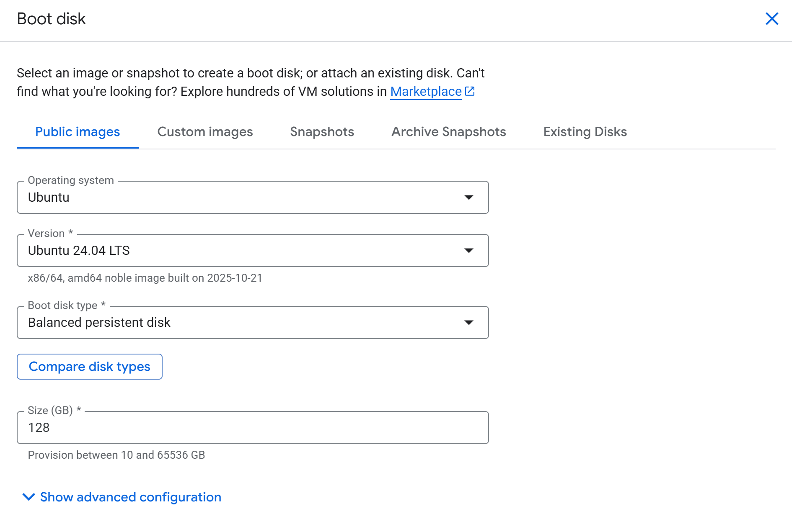

# ☁️ **GCP Virtual Machine Setup — LLMOps Travel Itinerary Planner**

In this stage, we deploy our environment to **Google Cloud Platform (GCP)** using a **Compute Engine Virtual Machine (VM)** and install the **Docker Engine**.
This setup provides a reliable cloud-based environment for building, testing, and running the **LLMOps Travel Itinerary Planner** inside containers.

## 🧭 **Step 1 — Launch a GCP VM**

1. Log into or sign up for **Google Cloud Platform**:
   [https://cloud.google.com/](https://cloud.google.com/)
2. Search for **Compute Engine** in the GCP console and go to **VM instances**.
3. Click **+ Create instance**.

### Machine Configuration

Keep all defaults **except** for the *Machine type*.
Change it to:

```
e2-standard-4 (4 vCPU, 2 core, 16 GB memory)
```

under the **Standard** tab.

### OS and Storage

Under **OS and storage**, click **Change** and select the options shown below:

<p align="center">
  
</p>

### Networking

Under **Networking → Firewall**, check:

* Allow HTTP traffic
* Allow HTTPS traffic
* Allow Load Balancer Health Checks

Also **enable IP forwarding**.

Click **Create** to launch the instance.

When the instance is ready, click **SSH** under *Connect* to open an SSH terminal.

## ⚙️ **Step 2 — Install Docker Engine**

Visit the official Docker documentation:
[https://docs.docker.com/engine/install/ubuntu/](https://docs.docker.com/engine/install/ubuntu/)

Scroll to **“Install using the apt repository”** and copy the commands under **1. Set up Docker’s apt repository**:

```bash
# Add Docker's official GPG key:
sudo apt-get update
sudo apt-get install ca-certificates curl
sudo install -m 0755 -d /etc/apt/keyrings
sudo curl -fsSL https://download.docker.com/linux/ubuntu/gpg -o /etc/apt/keyrings/docker.asc
sudo chmod a+r /etc/apt/keyrings/docker.asc

# Add the repository to Apt sources:
echo \
  "deb [arch=$(dpkg --print-architecture) signed-by=/etc/apt/keyrings/docker.asc] https://download.docker.com/linux/ubuntu \
  $(. /etc/os-release && echo "${UBUNTU_CODENAME:-$VERSION_CODENAME}") stable" | \
  sudo tee /etc/apt/sources.list.d/docker.list > /dev/null
sudo apt-get update
```

Then scroll to **2. Install the Docker packages** and run only:

```bash
sudo apt-get install docker-ce docker-ce-cli containerd.io docker-buildx-plugin docker-compose-plugin
```

To verify the installation:

```bash
sudo docker run hello-world
```

Expected output begins with:

```
Hello from Docker!
This message shows that your installation appears to be working correctly.
```

## 🧪 **Step 3 — Enable Docker for Your User**

Go to:
[https://docs.docker.com/engine/install/linux-postinstall/](https://docs.docker.com/engine/install/linux-postinstall/)

Copy and paste the following into your VM terminal:

```bash
sudo groupadd docker
sudo usermod -aG docker $USER
newgrp docker
docker run hello-world
```

This allows Docker commands without `sudo`.

Now scroll down to **“Configure Docker to start on boot with systemd”** and run:

```bash
sudo systemctl enable docker.service
sudo systemctl enable containerd.service
```

You should see output similar to:

```
Synchronizing state of docker.service with SysV service script with /usr/lib/systemd/systemd-sysv-install.
Executing: /usr/lib/systemd/systemd-sysv-install enable docker
```

## ✅ **Step 4 — Confirm Installation**

Finally:

```bash
docker version
```

You should see output similar to:

```
Client: Docker Engine - Community
 Version:           29.0.0
 API version:       1.52
 Go version:        go1.25.4
 Git commit:        3d4129b
 Built:             Mon Nov 10 21:46:31 2025
 OS/Arch:           linux/amd64
 Context:           default

Server: Docker Engine - Community
 Engine:
  Version:          29.0.0
  API version:      1.52 (minimum version 1.44)
  Go version:       go1.25.4
  Git commit:       d105562
  Built:            Mon Nov 10 21:46:31 2025
  OS/Arch:          linux/amd64
  Experimental:     false
 containerd:
  Version:          v2.1.5
  GitCommit:        fcd43222d6b07379a4be9786bda52438f0dd16a1
 runc:
  Version:          1.3.3
  GitCommit:        v1.3.3-0-gd842d771
 docker-init:
  Version:          0.19.0
  GitCommit:        de40ad0
```

Your **Docker Engine** is now fully installed and configured on your **GCP VM**, ready to support deployment of the **LLMOps Travel Itinerary Planner**.